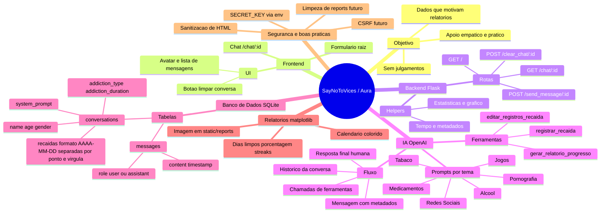
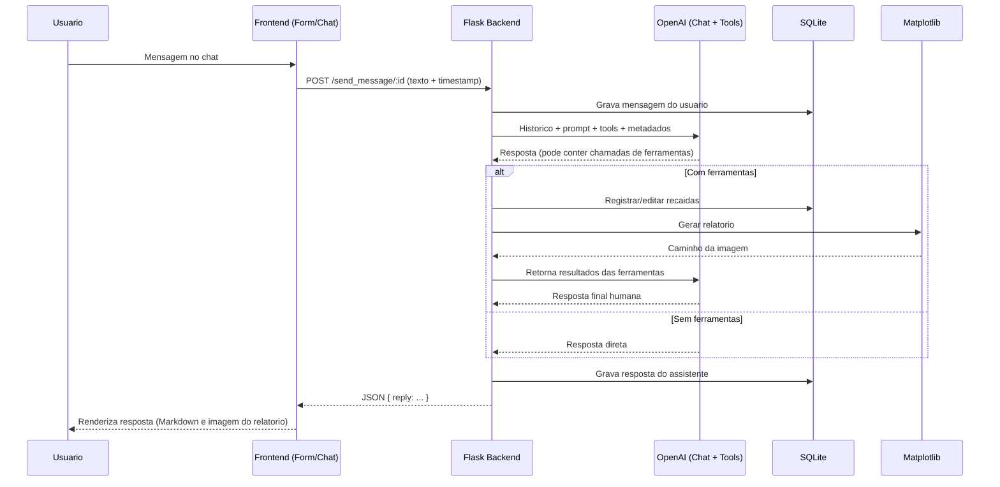

Boa! O erro veio do Mermaid no mindmap (caracteres como aspas e ponto-e-vírgula dentro do texto do nó). Abaixo está um README.md atualizado, com os diagramas corrigidos para renderizar no GitHub. É só colar na raiz do repositório.

---

# SayNoToVices • Aura 💚
Um assistente conversacional empático que apoia pessoas a reduzir ou deixar vícios — com registro de recaídas e relatórios visuais de progresso.  
Psicologia baseada em evidências, linguagem humana e dados que motivam, sem julgamentos.

- Backend: Flask + SQLite
- IA: OpenAI (function calling/tools)
- Visualização: matplotlib
- Renderização do bot: markdown-it-py

> ⚕️ Aviso: Este projeto é um apoio educacional e não substitui atendimento médico/psicológico. Em caso de crise, procure serviços de emergência locais (no Brasil, CVV: 188).

---

## ✨ Por que isso importa?
- 🫶 Acolhimento imediato e sem julgamento para quem precisa de ajuda agora.
- 📊 Motivação com dados: transforme progresso em imagem e métricas simples (streaks, % dias limpos).
- 🔒 Privacidade por padrão: roda localmente com SQLite.
- 🧭 Foco na segurança: orienta quando buscar atendimento profissional.

---

## 🧩 Recursos
- 📝 Formulário inicial que personaliza o atendimento (nome, idade, sexo, tipo de vício, duração).
- 💬 Chat caloroso e humano (Entrevista Motivacional, TCC/ACT/DBT, técnicas práticas).
- 🧷 Registro de recaídas (com validação de datas).
- ✏️ Edição de registros (adicionar/remover datas previamente registradas).
- 🗓️ Relatório visual (7 ou 30 dias) com:
  - Dias limpos, porcentagem limpa, maior sequência, sequência atual
  - Dia da semana mais crítico (se houver padrão)
- 💾 Histórico persistente em SQLite.
- 🔌 Suporte a vários tópicos: álcool, tabaco, pornografia, redes sociais, jogos, medicamentos prescritos (e expansível).

---

## 🏗️ Arquitetura (visão rápida)
1) Usuário preenche o formulário em /
2) O app cria uma conversa com um prompt especializado conforme o vício escolhido
3) Cada mensagem do usuário é enviada com metadados de tempo (dia/hora/período/tempo desde a última)
4) A IA pode acionar ferramentas:
   - registrar_recaida
   - editar_registros_recaida
   - gerar_relatorio_progresso
5) O backend executa no SQLite e retorna à IA, que responde de forma humana
6) O relatório vira uma imagem salva em static/reports e aparece no chat

Tecnologias: Python 3 + Flask + SQLite + OpenAI SDK + matplotlib + markdown-it-py

---

## 🧭 Esquema visual (Mapa mental + Fluxo)

Dica: o GitHub já suporta Mermaid. Se o mindmap não renderizar para você, use o diagrama ASCII de fallback logo abaixo.

Mapa mental (Mermaid):


Fluxo de requisição (Mermaid):


Fallback ASCII (se o mindmap não renderizar):
```
SayNoToVices / Aura
├─ Objetivo
│  ├─ Apoio empatico e pratico
│  ├─ Relatorios que motivam
│  └─ Sem julgamentos
├─ Frontend
│  ├─ Formulario (/)
│  └─ Chat (/chat/:id)
│     ├─ UI (avatar, lista, envio)
│     └─ Limpar conversa
├─ Backend (Flask)
│  ├─ Rotas: /, /chat/:id, /send_message/:id, /clear_chat/:id
│  └─ Helpers: tempo, estatisticas e grafico
├─ IA (OpenAI)
│  ├─ Prompts por tema
│  ├─ Ferramentas: registrar, editar, relatorio
│  └─ Fluxo: historico → ferramentas → resposta humana
├─ Banco (SQLite)
│  ├─ conversations (dados + recaidas)
│  └─ messages (role, content, timestamp)
└─ Relatorios (matplotlib)
   ├─ Calendario e metricas
   └─ Imagem em static/reports
```

---

## 🗂️ Estrutura do projeto
```
.
├── app.py
├── prompts.py
├── chat_history.db            # criado automaticamente
├── templates
│   ├── form.html
│   └── chat.html
├── static
│   ├── css/
│   ├── img/
│   ├── js/
│   └── reports/               # relatórios gerados (PNG)
├── .env                        # variáveis de ambiente (não commitar)
└── README.md
```

---

## 🗃️ Banco de dados
- conversations: dados do usuário, tipo de vício, prompt e campo recaidas (datas AAAA-MM-DD separadas por ponto e vírgula)
- messages: histórico (user/assistant), conteúdo e timestamp

Dica de evolução: migrar recaídas para uma tabela dedicada (id, conversation_id, date).

---

## ✅ Pré-requisitos
- Python 3.10+ (recomendado)
- Pip/venv
- Chave de API da OpenAI

---

## 🚀 Instalação e execução

1) Clone o repositório:
```
git clone https://github.com/SEU-USUARIO/SayNoToVices.git
cd SayNoToVices
```

2) Crie e ative um ambiente virtual:
```
python -m venv venv
# Windows
venv\Scripts\activate
# macOS/Linux
source venv/bin/activate
```

3) Instale as dependências:
```
pip install flask python-dotenv openai markdown-it-py matplotlib
# ou, se existir requirements.txt:
# pip install -r requirements.txt
```

4) Crie o arquivo .env na raiz:
```
OPENAI_API_KEY=coloque_sua_chave_aqui
# Opcional: defina o modelo disponível na sua conta
# MODEL_NAME=gpt-4o-mini
# Opcional: mova a SECRET_KEY para o .env e ajuste no app.py
# SECRET_KEY=uma-chave-secreta-longa-e-aleatoria
```

5) Inicialize o banco (opcional – o app cria se não existir):
```
flask --app app.py init-db
```

6) Rode o app:
```
python app.py
```

7) Acesse no navegador:
```
http://127.0.0.1:5000
```

---

## 🧪 Como usar
- 🧍 Formulário inicial: informe nome, idade, sexo, tipo de vício e há quanto tempo lida com isso.
- 💬 Chat: converse com o Aura; ele responde de forma humana e sem julgamentos.
- 📌 Recaídas: ao relatar um episódio fora do plano, o Aura confirma a data e registra.
- 📈 Relatórios: peça “meu progresso” e escolha “7 dias” ou “30 dias”; o chat mostra a imagem com as estatísticas.
- 🧽 Correções: peça para adicionar/remover uma data de recaída registrada por engano.
- 🗑️ Recomeçar: clique no ícone da lixeira para apagar a conversa e iniciar outra.

Dica: seja específico nas datas (“ontem”, “segunda”, “2025-08-05”). O Aura confirma antes de registrar.

---

## 🌐 Endpoints
- GET / — formulário inicial
- POST / — cria conversa e redireciona
- GET /chat/<conversation_id> — página do chat com histórico
- POST /send_message/<conversation_id> — envia mensagem e processa IA
- POST /clear_chat/<conversation_id> — apaga a conversa e limpa a sessão

---

## 🔐 Segurança e privacidade
- Este projeto não substitui atendimento clínico. Em emergências, procure ajuda local (Brasil: CVV 188).
- Dados ficam em SQLite local. Não há autenticação de usuário (use em ambiente controlado).
- Use SECRET_KEY forte via .env para produção.
- Renderização: respostas do bot passam por markdown-it-py. Se habilitar HTML para exibir  do relatório, sanitize com whitelist para reduzir riscos de XSS.
- CSRF: endpoints POST não têm CSRF token — adicione se for expor publicamente.

---

## 🎛️ Customização
- Novos tópicos de vício: edite prompts.py e acrescente seu prompt.
- Tom e linguagem: personalize os prompts para seu público.
- Gráficos: ajuste cores/fontes/layout em criar_grafico_progresso (app.py).
- Modelo da OpenAI: troque o nome do modelo no app (ou leia via variável MODEL_NAME).
- Banco: para escalar, migre para Postgres e crie tabela dedicada de recaídas.

---

## 🗺️ Roadmap
- 🛡️ Sanitizar HTML nas respostas (permitindo  do relatório com segurança)
- 🌍 Guardar fuso horário do usuário para datas/relatórios consistentes
- 🗄️ Tabela própria para recaídas
- 🧹 Limpeza automática de static/reports (arquivos antigos)
- 📡 Streaming (SSE) para respostas mais fluidas
- 🔐 Autenticação leve (retomar conversas em múltiplos dispositivos)
- 🤖 Testes automatizados e CI
- 🌐 i18n e temas

Nota: revisar o prompt “Drogas Ilícitas” (o texto atual menciona “redes sociais” por engano) ✅

---

## 🆘 Solução de problemas
- “Modelo gpt-5 não encontrado” → ajuste para um modelo disponível (ex.: gpt-4o-mini) no app.py ou via MODEL_NAME.
- Rate limit/timeout da OpenAI → tente novamente depois; adicione retry/timeout no código.
- Imagem do relatório não aparece → habilite HTML no MarkdownIt e sanitize, ou exiba a imagem por outro mecanismo.
- Fonte “Arial” indisponível no matplotlib → troque por uma fonte padrão do sistema.

---

## 🤝 Contribuindo
Contribuições são bem-vindas!

1) Fork  
2) Branch:
```
git checkout -b feat/minha-feature
```
3) Commit e push:
```
git commit -m "Adiciona minha feature"
git push origin feat/minha-feature
```
4) Abra um PR descrevendo claramente a mudança.

Sugestões: segurança (sanitização/CSRF), prompts, migração da coluna “recaidas”, testes.

---

## 📄 Licença
Escolha e adicione sua licença (ex.: MIT, Apache-2.0).  
Inclua um arquivo LICENSE e referencie aqui.

---

## 📷 Screenshots
- Adicione aqui prints do formulário, do chat e um exemplo de relatório para enriquecer o GitHub.  
Sugestão: uma pasta docs/ com imagens e GIFs curtos.

---

Feito com carinho para quem luta por dias melhores. Você não está sozinho(a). 💙
